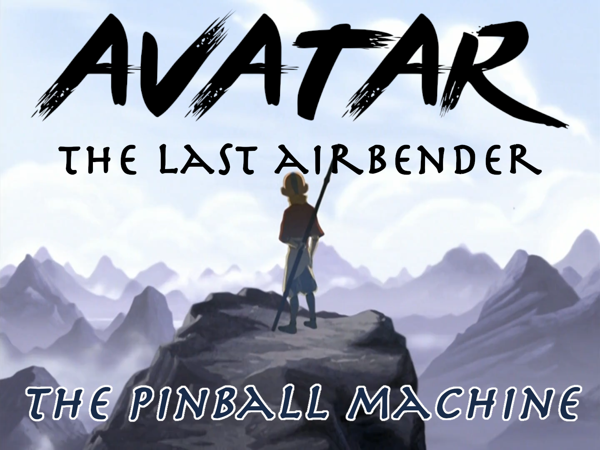

# Avatar - The Last Airbender (pinball)

-----
## Introduction

#### Avatar - The Last Airbender (ATLA), the pinball machine!

This repository tracks the over-arching project as a whole.

-----
## Resources

### Fonts

- [Font details](resources/fonts/)

-----
## Credits

### Krayon

- Concept
- Interface Design
- Rules
- Programming
- Layout
- Electronics

### Mrs Krayon

- Concept
- Interface Design
- Rules

### MPF Community

- Programming

### Open Pinball Project

- Circuit Design

-----
[//]: # ( vim: set ts=4 sw=4 et cindent tw=80 ai si syn=markdown ft=markdown: )
